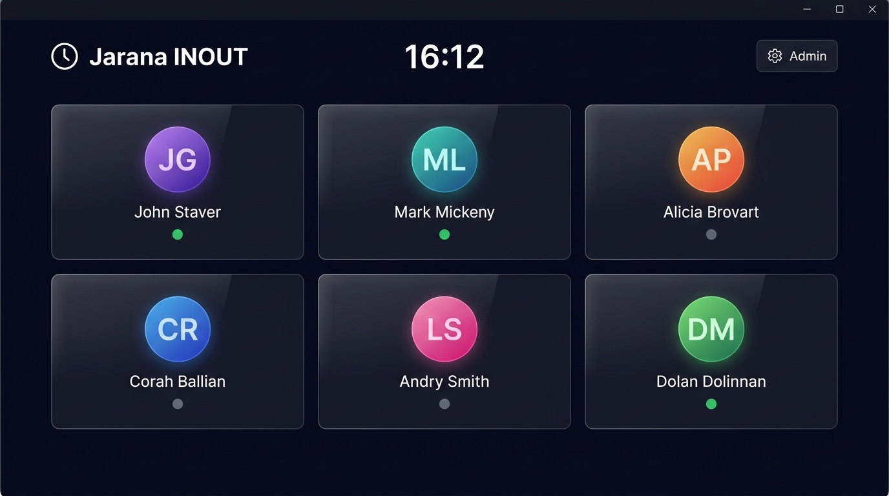
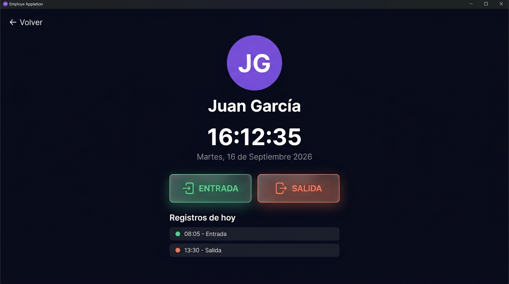
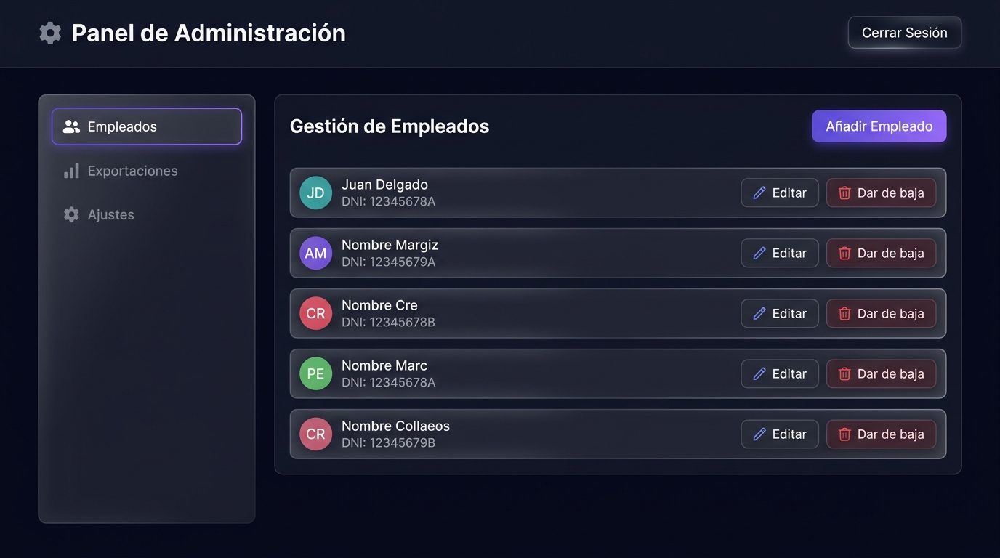

# ⏱ Jarana INOUT - Sistema de Control Horario

¡Bienvenido a **Jarana INOUT**! La solución definitiva, rápida y 100% privada para el registro de jornada laboral en pequeñas y medianas empresas.

Pensado para colocarse en un terminal a la entrada del establecimiento, Jarana INOUT elimina la fricción de los fichajes diarios con una interfaz moderna y táctil, al tiempo que facilita enormemente la labor de recursos humanos gracias a su generación automática de reportes en Excel.

---

## 🌟 Características Principales

* 🔒 **100% Privado y Offline:** Todos los datos se guardan en el ordenador local de la empresa. Sin nubes, sin suscripciones, sin riesgos de fuga de datos por internet.
* 🧠 **Redondeo Inteligente:** Se acabó calcular los minutos exactos. Las entradas se redondean siempre hacia arriba al múltiplo de 5 (ej: 08:02 -> 08:05) y las salidas hacia abajo, favoreciendo un cálculo de horas limpio para los trabajadores.
* 🛡️ **Prevención de Errores y Tolerancia (10 min):** Si un empleado ficha salida por error nada más entrar, el sistema detecta márgenes menores a 10 minutos y ofrece la anulación automática del fichaje.
* 🌙 **Recuperación de Olvidos y Turnos Nocturnos:** Si un empleado olvida fichar la salida y transcurren más de 8 horas, la app despliega un asistente que le pregunta: *«¿A qué hora te fuiste?»*, permitiendo elegir si salió el mismo día o de madrugada (+1 día) para turnos que cruzan la medianoche. El empleado queda libre para fichar su nueva jornada.
* 📩 **Bandeja de Peticiones para el Jefe:** Los olvidos de salida generan una petición en el panel del administrador con avisos visuales (badges). El jefe puede revisar la hora indicada, aprobarla o ajustarla antes de consolidarla en el registro oficial.
* 📊 **Exportación Profesional a Excel:** Con un solo clic, descarga los reportes de un empleado específico o genera un informe masivo con todos los empleados separados por pestañas.
* 👥 **Gestión Histórica (Altas y Bajas):** Mantén tu panel principal limpio dando de baja a exempleados, pero conservando todo su historial legal intacto en el sistema.

---

## 📸 Interfaz y Uso

### 1. Pantalla Principal (El Kiosco)
La pantalla principal está diseñada para ser utilizada por los empleados en su día a día. Simplemente ven su nombre, pulsan sobre su tarjeta y eligen si entran o salen. Incluye indicador visual si el administrador tiene peticiones pendientes.



### 2. Panel de Fichaje y Asistente de Olvidos
Al seleccionar un empleado, la pantalla cambia a un diseño limpio con dos grandes botones (Entrada y Salida), ideales para pantallas táctiles. Además, muestra el historial de movimientos del empleado en el día actual para evitar dudas. Si el empleado olvidó fichar su turno anterior (más de 8 horas), salta automáticamente el asistente táctil para indicar su hora de salida y desbloquear su nuevo turno.



### 3. Panel de Administración
El corazón del sistema para los responsables de RRHH. Protegido por usuario y contraseña, se divide en un menú lateral muy intuitivo:
- **Gestión de Empleados:** Añade, edita, da de baja o restaura trabajadores.
- **Peticiones:** Bandeja de incidencias con solicitudes de salida olvidadas para aprobar o modificar con 1 clic.
- **Exportaciones:** Genera los archivos Excel legales necesarios para inspecciones de trabajo.
- **Ajustes:** Modifica las credenciales de acceso.



---

## 🚀 Instalación para el Cliente

1. Descomprime y abre la carpeta del programa.
2. Ejecuta el acceso directo de **Jarana INOUT**.
3. ¡Listo! El programa se iniciará en pantalla completa listo para ser usado.

*Para desarrolladores:*
```bash
npm install
npm start
```

---
*Jarana INOUT - Control horario sin complicaciones.*
